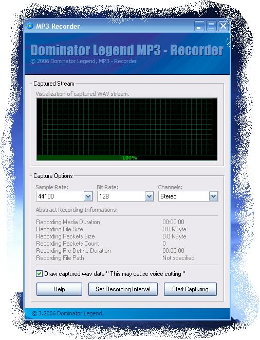



## MP3 Recorder

### Description

Cause of the limitation on Windows Recorder, this recorder is used, This recorder will record the signals from mic or stereo mix to an MP3 file, you can control the quality of the file, This application depend on Blade Encoder, and for some reasons Blade Encoder Unaccessible from VB, Thanks a lot for CVMichael [VBWire], For providing the Wrabber VBBladeEncoder, and also for providing his Encoder, This application builte above CVMichael Encoder with some addition and its fully commented Green is more than black ;), I search PSC for Mp3 recorder and didn't found one, so i thought to share this,

----

Hope that PSC Moderator to keep the dlls intact cause app. won't work without DLLS, Hay guys there is a other solution than deleting dlls from submitting!!!! Check Maleware, test it!!!!, But don'w wast an submition for doupting,

----

Any way here an Temp path to library, may be unavailable in any time!!!!

----

http://www40.brinkster.com/DominatorLegend/Default.Asp

----

Thanks, Hope u like it, vote it if you like it
 
### More Info
 

             |
---                |---
**Submitted On**   |2006-03-25 02:42:22
**By**             |[Dominator Legend](https://github.com/Planet-Source-Code/PSCIndex/blob/master/ByAuthor/dominator-legend.md)
**Level**          |Intermediate
**User Rating**    |4.5 (36 globes from 8 users)
**Compatibility**  |VB 6\.0
**Category**       |[Sound/MP3](https://github.com/Planet-Source-Code/PSCIndex/blob/master/ByCategory/sound-mp3__1-45.md)
**World**          |[Visual Basic](https://github.com/Planet-Source-Code/PSCIndex/blob/master/ByWorld/visual-basic.md)
**Archive File**   |[MP3\_Record1983203262006\.zip](https://github.com/Planet-Source-Code/dominator-legend-mp3-recorder__1-64815/archive/master.zip)

